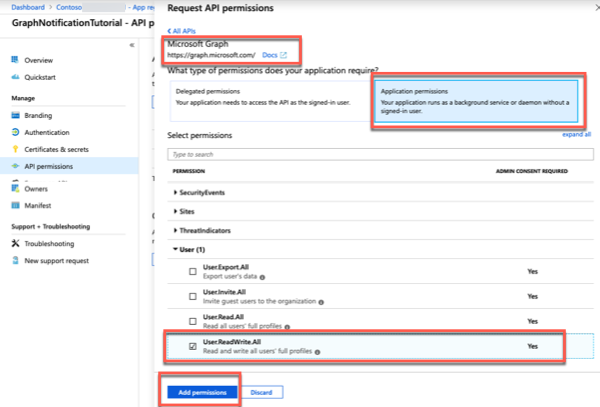

<!-- markdownlint-disable MD002 MD041 -->

В этом упражнении вы создадите регистрацию нового веб-приложения Azure AD с помощью центра администрирования Azure Active Directory и выдасте согласие администратора для требуемых областей разрешений.

1. Откройте браузер и перейдите в [центр администрирования Azure Active Directory (https://aad.portal.azure.com)](https://aad.portal.azure.com). Войдите с помощью **рабочей или учебной учетной записи**.

1. Выберите **Azure Active Directory** на панели навигации слева, затем выберите **Регистрация приложений** в разделе **Управление**.

    

1. Выберите **Новая регистрация**. На странице **Регистрация приложения**

    

    Задайте значения следующим образом:

    - **Name**: графнотификатионтуториал
    - **Поддерживаемые типы учетных**записей: учетные записи в любых организациях и личных учетных записях Майкрософт
    - **URI перенаправления**: веб->http://localhost

    

    Выберите **регистр**.

1. На странице **графнотификатионтуториал** скопируйте значение ID **Application (Client) ID** и **Directory (Client) ID (идентификатор клиента)** , чтобы они потребуются на следующем шаге.

    

1. Выберите **Управление сертификатами > & секреты**. 

    Выберите **новый секрет клиента**.

    Введите значение в поле **Описание** и выберите один из вариантов **истечения срока действия** , а затем нажмите кнопку **добавить**.

    

    

1. Скопируйте значение секрета клиента, а затем покиньте эту страницу. Оно вам понадобится на следующем шаге.

    > [!IMPORTANT]
    > Это секрет клиента, он никогда не отображается еще раз, поэтому убедитесь, что вы скопировали его.

    

1. Выберите **Управление Разрешениями > API**.

    Выберите **Добавить разрешение** и выберите **Microsoft Graph**.

    

    Выберите **разрешение приложения**, разверните группу **пользователей** и выберите **User. ReadWrite. ALL** .

    Нажмите кнопку **Добавить разрешения** , чтобы сохранить изменения.

    

    

Приложение запрашивает разрешение приложения с областью **User. ReadWrite. ALL** . Для этого разрешения требуется согласие администратора.

Выберите параметр **предоставить согласие администратора для Contoso**, а затем выберите **Да** , чтобы согласиться с этим приложением и предоставить приложению доступ к клиенту с помощью указанных областей.

