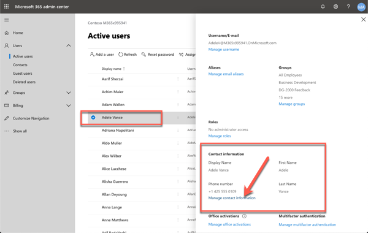

<!-- markdownlint-disable MD002 MD041 -->

Создайте конфигурацию запуска, чтобы отладить приложение в Visual Studio Code.

В Visual Studio Code выберите **отладка > открытых конфигураций**.

  

Когда будет предложено выбрать среду, выберите пункт **.NET Core**.

  

> [!NOTE]
> По умолчанию при запуске отладчика конфигурация запуска ядра .NET будет открывать браузер и переходить к URL-адресу по умолчанию для приложения. Для этого приложения вместо этого мы хотим перейти по URL-адресу NGrok. Если вы оставляете конфигурацию запуска как есть, при каждой отладке приложения будет отображаться сломанная страница. Вы можете просто изменить URL-адрес или изменить конфигурацию запуска, чтобы не запустить браузер:

Обновите конфигурацию запуска отладчика Visual Studio:

  1. В Visual Studio Code откройте файл file **. вскоде/Launch. JSON**.
  1. В конфигурации по умолчанию откройте следующий раздел:

      ```json
      "launchBrowser": {
        "enabled": true
      },
      ```

  1. Задайте для `enabled` `false`свойства значение.
  1. Сохраните изменения.

### <a name="test-the-application"></a>Тестирование приложения:

В Visual Studio Code выберите **отладка > начать отладку** для запуска приложения. Код VS создает приложение и создает звезду.

После последующего отображения в окне **консоли отладки** ...


... Откройте браузер и перейдите **http://localhost:5000/api/notifications** в раздел, чтобы подписаться на уведомления об изменении. При успешном выполнении вы увидите выходные данные, включающие идентификатор подписки, подобный показанному ниже:


Теперь ваше приложение подписано на получение уведомлений от Microsoft Graph при обновлении пользователей в клиенте Office 365.

Инициация уведомления:

1. Откройте браузер и перейдите в [центр администрирования Microsoft 365 (https://admin.microsoft.com/AdminPortal)](https://admin.microsoft.com/AdminPortal).
1. Если вам будет предложено войти, войдите с помощью учетной записи администратора.
1. Выберите **пользователи > активные пользователи**.

    

1. Выберите активного пользователя и нажмите **изменить** для его **контактной информации**.

    

1. Обновите значение **номера телефона** , указав новое число и нажмите кнопку **сохранить**.

    В **консоли отладки**кода Visual Studio вы увидите, что уведомление получено. Иногда это может занять несколько минут. Ниже приведен пример выходных данных.

    ```shell
    Received notification: 'Users/7a7fded6-0269-42c2-a0be-512d58da4463', 7a7fded6-0269-42c2-a0be-512d58da4463
    ```

Это означает, что приложение успешно получало уведомление от Microsoft Graph для пользователя, указанного в выходных данных. Затем вы можете использовать эти сведения для получения подробных сведений о пользователях в Microsoft Graph, если вы хотите синхронизировать их с приложением.